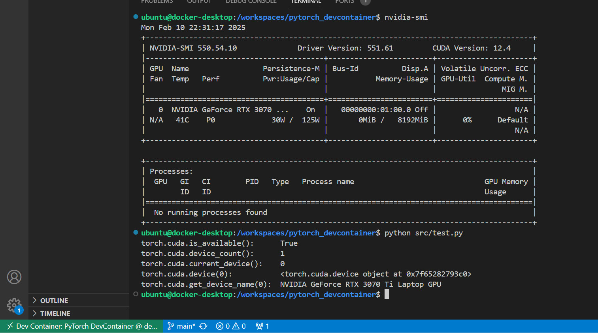
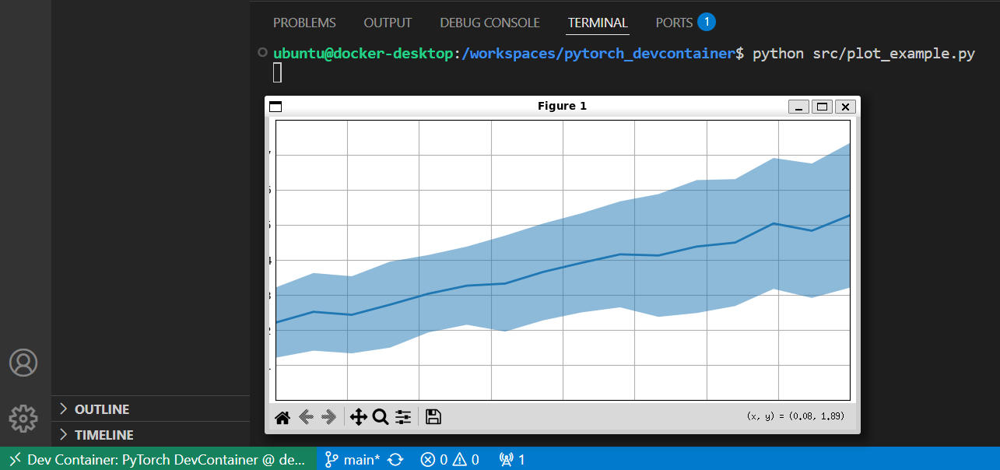

# PyTorch DevContainer
DevContainer setup for running PyTorch. 

## Requirements
- [Visual Studio Code](https://code.visualstudio.com/)
- [Remote Development extension pack](https://marketplace.visualstudio.com/items?itemName=ms-vscode-remote.vscode-remote-extensionpack) in Visual Studio Code Marketplace.
- [Docker](https://www.docker.com/get-started/)


## Getting Started
1. Clone and open the repository in VS Code
    ```sh
    git clone https://github.com/nariaga2/pytorch_devcontainer.git
    code pytorch_devcontainer
    ```

2. Reopen in Container


https://github.com/user-attachments/assets/8d09056a-3790-4e9a-9226-dc3e4273d62a


3. Run demo script
```sh
python src/test.py
```

Output




```sh
python src/plot_example.py
```

Output




